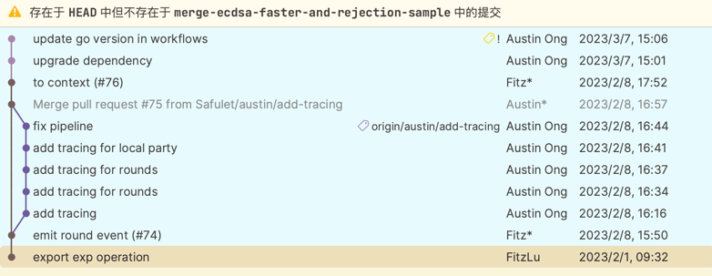
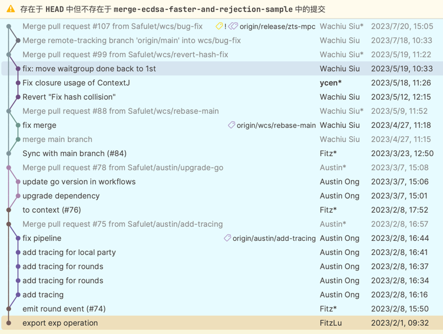
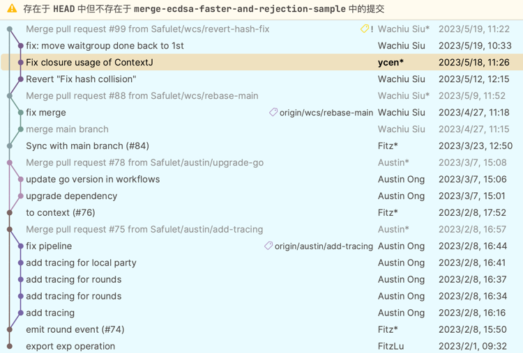

# Notes for PR #113

## Current Dev Branches

- SuperCold
  - iOS: mobile-wrapper(release/1.6.0) 
    - tss-lib-private: v1.6.0-go15

- ColdGuardian
  - iOS: mpcsdk(0.23.0)
    - tss-lib-private: v1.6.0-go15.0.20230307070646-2cd8828d1908

- Cosign
  - iOS: mpcsdk(0.32.2)
    - tss-lib-private: v1.6.2-go15.0.20230720070510-4b8bf873d19e
  - Android:: mpcsdk(0.32.2)
      - tss-lib-private: v1.6.2-go15.0.20230720070510-4b8bf873d19e

- BUW
  - iOS: mpcsdk(0.25.0)
    - tss-lib-private: v1.6.0-go15.0.20230519032244-d34804e85604
  - Android: mpcsdk(0.25.1)
      - tss-lib-private: v1.6.0-go15.0.20230519032244-d34804e85604

## Noticable changes

* ZIL/Mina Schnorr protocol
* KCDSA protocol
* ToB audit security updates
    * BLS curve renamed to BLS12381G1, BLS12381G2
    * Update edwards25519 impl, remove dep of private fork
* Restore private sk function(from Fitz)
* ContextJ issue (used to cause a low probability of fail to verify correct proofs received)
* Non-hardened child key derivation for all protocols(include ZIL/Mina SChnorr, KCDSA)
* (derivekey protocol) Hardened child key derivation protocol
* RejectSample update (serious security bug, not backward compatible)
* Hash function update (not backward compatible)

## Commitments that are not included

### (2cd88a8d)

### (4b8bf87)

### (d34804e)
